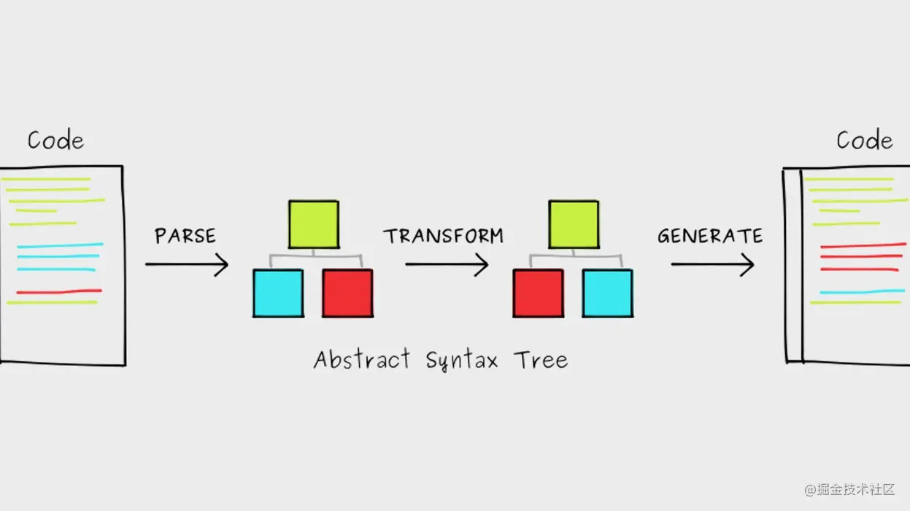

# 抽象语法树AST

> 所谓抽象语法树，就是将代码字符串，挨个字符遍历，按照指定的分割符号，解析成指定格式的树状结构。



## 什么是AST

抽象语法树（abstract syntax code，AST）是源代码的抽象语法结构的树状表示，树上的每个节点都表示源代码中的一种结构，之所以说是抽象的，抽象表示把js代码进行了结构化的转化，转化为一种数据结构。这种数据结构其实就是一个大的json对象，json我们都熟悉，他就像一颗枝繁叶茂的树。有树根，有树干，有树枝，有树叶，无论多小多大，都是一棵完整的树。

简单理解,就是把我们写的代码按照一定的规则转换成一种树形结构。

[引用](https://zhuanlan.zhihu.com/p/266697614)

## 用处

AST的作用不仅仅是用来在JavaScript引擎的编译上，我们在实际的开发过程中也是经常使用的，比如我们常用的babel插件将 ES6转化成ES5、使用 UglifyJS来压缩代码 、css预处理器、开发WebPack插件、Vue-cli前端自动化工具等等，这些底层原理都是基于AST来实现的，AST能力十分强大， 能够帮助开发者理解JavaScript这门语言的精髓。

[引用](https://zhuanlan.zhihu.com/p/266697614)


## 详解

大部分javascript解析器都分为3个部分：解析(Parsing)、转义(Transformation)、生成(Code Generation)

### 解析(Parsing)

解析分为：词法分析(Lexical Analysis)、语法分析(Syntactic Analysis)

1. *词法分析*：读取我们的代码，然后把它们按照预定的规则合并成一个个的标识tokens。同时，它会移除空白符，注释，等。最后，整个代码将被分割进一个tokens列表（或者说一维数组）。当词法分析源代码的时候，它会一个一个字母地读取代码，所以很形象地称之为扫描-scans；当它遇到空格，操作符，或者特殊符号的时候，它会认为一个词已经完成了。示例：
``` javascript
// [
//   { type: 'paren',  value: '('        },
//   { type: 'name',   value: 'add'      },
//   { type: 'number', value: '2'        },
//   { type: 'paren',  value: '('        },
//   { type: 'name',   value: 'subtract' },
//   { type: 'number', value: '4'        },
//   { type: 'number', value: '2'        },
//   { type: 'paren',  value: ')'        },
//   { type: 'paren',  value: ')'        },
// ]
```
1. *语法分析*：它会将词法分析出来的数组转化成树形的表达形式。同时，验证语法，语法如果有错的话，抛出语法错误。当生成树的时候，解析器会删除一些没必要的标识tokens（比如不完整的括号），因此AST不是100%与源码匹配的，但是已经能让我们知道如何处理了。说个题外话，解析器100%覆盖所有代码结构生成树叫做CST（具体语法树）；示例：
``` javascript
<<<<<<< HEAD
// {
//   type: 'Program',
//   body: [{
//     type: 'CallExpression',
//     name: 'add',
//     params: [{
//       type: 'NumberLiteral',
//       value: '2',
//     }, {
//       type: 'CallExpression',
//       name: 'subtract',
//       params: [{
//         type: 'NumberLiteral',
//         value: '4',
//       }, {
//         type: 'NumberLiteral',
//         value: '2',
//       }]
//     }]
//   }]
// }
```

### 转义(Transformation)

遍历所有的节点

### 生成

生成语法树

## 简单的解析器

``` javascript
/**
 * 将我们的代码按照预定的规则合并成一个个的标识tokens
 */
function tokenizer(input) {

  let current = 0;

  let tokens = [];

  while (current < input.length) {

    let char = input[current];

    if (char === '(') {
      tokens.push({
        type: 'paren',
        value: '(',
      });

      current++;

      continue;
    }

    if (char === ')') {
      tokens.push({
        type: 'paren',
        value: ')',
      });
      current++;
      continue;
    }

    let WHITESPACE = /\s/;
    if (WHITESPACE.test(char)) {
      current++;
      continue;
    }

    let NUMBERS = /[0-9]/;
    if (NUMBERS.test(char)) {

      let value = '';

      while (NUMBERS.test(char)) {
        value += char;
        char = input[++current];
      }

      tokens.push({ type: 'number', value });

      continue;
    }

    if (char === '"') {
      let value = '';

      char = input[++current];

      while (char !== '"') {
        value += char;
        char = input[++current];
      }

      char = input[++current];

      tokens.push({ type: 'string', value });

      continue;
    }

    let LETTERS = /[a-z]/i;
    if (LETTERS.test(char)) {
      let value = '';

      while (LETTERS.test(char)) {
        value += char;
        char = input[++current];
      }

      tokens.push({ type: 'name', value });

      continue;
    }

    throw new TypeError('I dont know what this character is: ' + char);
  }

  return tokens;
}

/**
 * 判断这些token，并根据tokens类型，初步组装成一棵ast树
 */
function parser(tokens) {

  let current = 0;

  function walk() {

    let token = tokens[current];

    if (token.type === 'number') {

      current++;

      return {
        type: 'NumberLiteral',
        value: token.value,
      };
    }

    if (token.type === 'string') {
      current++;

      return {
        type: 'StringLiteral',
        value: token.value,
      };
    }

    if (
      token.type === 'paren' &&
      token.value === '('
    ) {

      token = tokens[++current];

      let node = {
        type: 'CallExpression',
        name: token.value,
        params: [],
      };

      token = tokens[++current];

      while (
        (token.type !== 'paren') ||
        (token.type === 'paren' && token.value !== ')')
      ) {
        node.params.push(walk());
        token = tokens[current];
      }

      current++;

      return node;
    }

    throw new TypeError(token.type);
  }

  let ast = {
    type: 'Program',
    body: [],
  };

  while (current < tokens.length) {
    ast.body.push(walk());
  }

  return ast;
}

/**
 * 
 */
function traverser(ast, visitor) {

  function traverseArray(array, parent) {
    array.forEach(child => {
      traverseNode(child, parent);
    });
  }

  function traverseNode(node, parent) {

    let methods = visitor[node.type];

    if (methods && methods.enter) {
      methods.enter(node, parent);
    }

    switch (node.type) {

      case 'Program':
        traverseArray(node.body, node);
        break;

      case 'CallExpression':
        traverseArray(node.params, node);
        break;

      case 'NumberLiteral':
      case 'StringLiteral':
        break;

      default:
        throw new TypeError(node.type);
    }

    if (methods && methods.exit) {
      methods.exit(node, parent);
    }
  }

  traverseNode(ast, null);
}

/**
 * 生成
 * 生成不同类型的节点
 */
function transformer(ast) {

  let newAst = {
    type: 'Program',
    body: [],
  };

  ast._context = newAst.body;

  traverser(ast, {

    NumberLiteral: {
      enter(node, parent) {
        parent._context.push({
          type: 'NumberLiteral',
          value: node.value,
        });
      },
    },

    StringLiteral: {
      enter(node, parent) {
        parent._context.push({
          type: 'StringLiteral',
          value: node.value,
        });
      },
    },

    CallExpression: {
      enter(node, parent) {

        let expression = {
          type: 'CallExpression',
          callee: {
            type: 'Identifier',
            name: node.name,
          },
          arguments: [],
        };

        node._context = expression.arguments;

        if (parent.type !== 'CallExpression') {

          expression = {
            type: 'ExpressionStatement',
            expression: expression,
          };
        }

        parent._context.push(expression);
      },
    }
  });

  return newAst;
}

/**
 * 生成代码
 */
function codeGenerator(node) {

  switch (node.type) {

    case 'Program':
      return node.body.map(codeGenerator)
        .join('\n');

    case 'ExpressionStatement':
      return (
        codeGenerator(node.expression) +
        ';' // << (...because we like to code the *correct* way)
      );

    case 'CallExpression':
      return (
        codeGenerator(node.callee) +
        '(' +
        node.arguments.map(codeGenerator)
          .join(', ') +
        ')'
      );

    case 'Identifier':
      return node.name;

    case 'NumberLiteral':
      return node.value;

    case 'StringLiteral':
      return '"' + node.value + '"';

    default:
      throw new TypeError(node.type);
  }
}

function compiler(input) {
  let tokens = tokenizer(input);
  let ast    = parser(tokens);
  let newAst = transformer(ast);
  let output = codeGenerator(newAst);

  return output;
}
```

> [博客代码出处](https://hub.fastgit.org/bujidao/the-super-tiny-compiler/blob/master/the-super-tiny-compiler.js)

> [文章](https://juejin.cn/post/6844903725228621832)
=======
```
>>>>>>> dev
