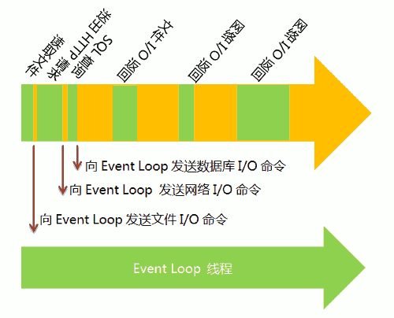

## Event-Loop

> a programming construct that waits for and dispatches events or messages in a program.

!> 原理：CPU分时调度(主要站在计算机原理的角度进行分析)

运行以后的程序叫`进程`，一般情况下，一个进程一次只能执行一个任务。
如果有很多任务需要执行，一般采取以下几种方法：
1. 排队： 一个进程一次只能执行一个任务，因此需要等待前面的任务完成；
1. 新建进程：为每个任务创建一个进程；
1. 新建线程：由于创建进程的代价比较大，比较耗费资源，因此一个进程里面通常包含多个线程，由线程去完成任务；

JS是一种`单线程`语言，所有的任务都在一个`线程`上完成，即第一种情况。

只有当前任务结束以后，才可以进行下一个任务，这种运行方式称为"同步模式"（synchronous I/O）或"堵塞模式"（blocking I/O）。

为了防止某些耗时任务导致的阻塞，也为了预防多线程造成成倍资源的浪费，因此提出`Event Loop`这个概念。

简单说，就是在程序中设置两个线程：
一个负责程序本身的运行，称为"主线程"；
另一个负责主线程与其他进程（主要是各种I/O操作）的通信，被称为"Event Loop线程"（可以译为"消息线程"）。

上图主线程的绿色部分，还是表示运行时间，而橙色部分表示空闲时间。每当遇到I/O的时候，主线程就让Event Loop线程去通知相应的I/O程序，然后接着往后运行，所以不存在红色的等待时间。等到I/O程序完成操作，Event Loop线程再把结果返回主线程。主线程就调用事先设定的回调函数，完成整个任务。

可以看到，由于多出了橙色的空闲时间，所以主线程得以运行更多的任务，这就提高了效率。这种运行方式称为"异步模式"（asynchronous I/O）或"非堵塞模式"（non-blocking mode）。

> 文章参考来源 [什么是 Event Loop？](http://www.ruanyifeng.com/blog/2013/10/event_loop.html)

**扩展**

> 你也许会问，JavaScript为什么是单线程，难道不能实现为多线程吗？
>
>这跟历史有关系。JavaScript从诞生起就是单线程。原因大概是不想让浏览器变得太复杂，因为多线程需要共享资源、且有可能修改彼此的运行结果，对于一种网页脚本语言来说，这就太复杂了。后来就约定俗成，JavaScript为一种单线程语言。（Worker API可以实现多线程，但是JavaScript本身始终是单线程的。）