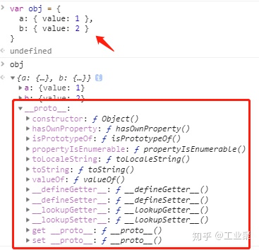
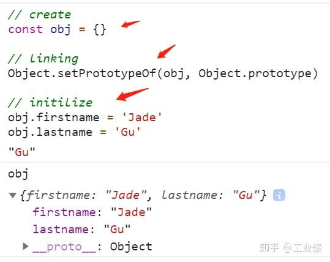
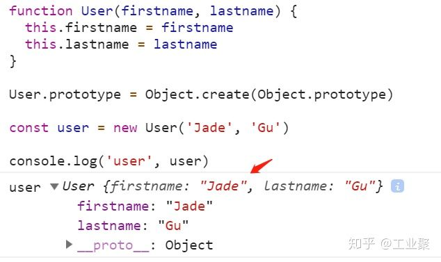
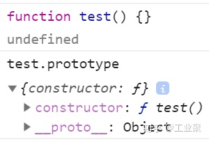
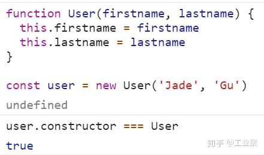
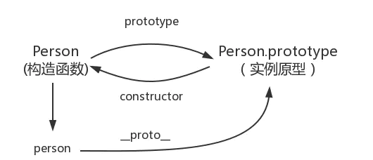

# prototype/__proto__

!> 原型存在的意义就是解决属性与方法共享的问题，减少不必要的内存消耗。

## prototype

!> `prototype`是一个对象，是一个给其他对象提供共享属性的对象

也就是说：`prototype` 本身就是一个对象，只是被用于承担某种职能罢了

给定所有对象，我们可以为不同的对象，分配不同的职能，然后给予不同的称谓；

当某个对象，承担为其他对象提供共享的属性的职责时，它就成了该对象的`prototype`，当它失去这个职能的时候，它就*不叫*该对象的`prototype`

换句话说，当我们说 `prototype` 对象的时候，是在做一个简易描述，全称应该是：“xx对象的 `prototype` 对象”。如通不跟其他对象产生关联，就不构成 `prototype` 这个称谓

因此，`prototype` 描述的是两个对象之间的某种关系（其中一个为另一个提供访问的权限），他是类似father一样的称谓。

所有对象，都可以作为另一个对象的 `prototype`

### 所有对象，都有一个隐式引用

> Every object has an implicit reference (called the object's prototype)

所有对象，都有一个隐式引用，它被称之为这个对象的 prototype 原型。

什么叫隐式引用？



如上图所示，在我们编写的代码里，只声明了 obj 对象的 a 和 b 两个属性。在控制台却可以发现它有 __proto__ 属性，这意味着 obj 被隐式地挂载了另一个对象的引用，置于 __proto__ 属性中。

也就是说，所谓的隐式，是指不是由开发者(你和我)亲自创建/操作。

### 历史问题：__proto__

ECMAScript 规范说 prototype 应当是一个隐式引用:

1. 通过 `Object.getPrototypeOf(obj)` 间接访问指定对象的 `prototype` 对象
1. 通过 `Object.setPrototypeOf(obj)` 间接设置指定对象的 `prototype` 对象
1. 部分浏览器提前开了 `__proto__` 的口子，使得可以直接通过 `obj.__proto__` 访问和设置原型

_proto__ 属性既不能被 for in 遍历出来，也不能被 Object.keys(obj) 查找出来。

访问对象的 obj.__proto__ 属性，默认走的是 Object.prototype 对象上 __proto__ 属性的 get/set 方法。

## 对象的创建和关联原型

两种方法可以继承对象：显式继承、隐式继承

### 显式继承

两种方法：

* `Object.setPrototypeOf(obja, objb)`: objb 是 obja 的 prototype
* `Object.create(obja)`: 新对象以 obja 为 prototype 对象

### 隐式继承

想要得到一个包含数据、方法、以及关联原型的三个组成部分的丰满对象，一个相对具体的步骤图下：

1. 创建对象：创建空对象
1. 设置原型：设置该空对象的原型为另一个对象或者null
1. 填充对象：增加属性、方法。

假如没有隐式原型继承，创建一个普通的js对象，要向下面的



看起来比较繁琐

产品经理发话了，要让用户无感知的完成对象的创建、原型的继承、和属性的初始化的过程。

架构师想了一下，设计了一个方案：

1. 我们将某些函数称为 `constructor` ，专门用来做属性初始化。
``` javascript
function User(firstname, lastname) {
    this.firstname = firstname
    this.lastname = lastname
}
```
1. 我们约定，`constructor`函数有一个特殊的属性 `prototype`
``` javascript
User.prototype = Object.create(Object.prototype)
```
1. 让用户使用 `new` 关键字，去创建新对象
``` javascript
const user = new User('zhang', 'san')
```
1. 在内部，我们偷偷的做了关联对象、关联原型、属性初始化等一系列过程。



用户能拿到跟自己手动创建一样的结果，但是从3件事情，变成2件事情。

产品经理又表示了，用户最好只做一件事情，这样就完美了；

架构师说：好吧，我让所有的函数，都有 `prototype` 属性，它默认是以 `Object.prototype` 为原型的对象。

这样用户通常只需要编写 `constructor` 函数，描述如何初始化对象的属性即可。除非他们需要新增方法，否则都不必操作 `constructor` 的 `prototype` 对象



如上，普通函数创建时，自带了 prototype 属性，该属性是一个对象，包含了 constructor 字段，指向构造函数。



我们的User定义，简化为一个User函数，通过new关键字去创建 user 对象，可以通过 user.construcrot 访问到它的构造函数

### 内置构造函数和语法糖


> JS中每次创建一个函数，该函数就会自动带有一个 prototype 属性，该属性指向函数的原型对象。

``` javascript
function Test() {}
var test = new Test()

console.log(Test.prototype === test.__proto__) // true
```
上述例子中，函数`Test`的`prototype`指向了一个对象，而这个对象是调用构造函数时创建的实例的原型，也就是`test.__proto__`等于`Test.prototype`

## __proto__

每个js对象中都会存在的属性，这个属性，会指向该对象的原型，使用  `Object.getPrototypeOf`函数，作为获取对象原型的标准API

> 每一个对象数据类型(普通的对象、实例、prototype......)也天生自带一个属性__proto__，属性值是当前实例所属类的原型(prototype)。原型对象中有一个属性constructor, 它指向函数对象。



## 对比

### 对应名称

* `prototype` : 原型
* `__proto__` : 原型链（节点）

### 从属关系

* `prototype` : 函数的一个属性：对象{}
* `__proto__` : 对象Object的一个属性：对象{}

对象的__proto__保存着该对象构造函数的prototype
``` javascript
function Test() {}

const test = new Test()

console.log(test.__proto__ === Test.prototype) // true

console.log(Test.prototype.__proto__ === Object.prototype) // true

console.log(Object.prototype.__proto__) // null

```

## 参考

[【深入理解 JavaScript 原型】](https://zhuanlan.zhihu.com/p/87667349)
